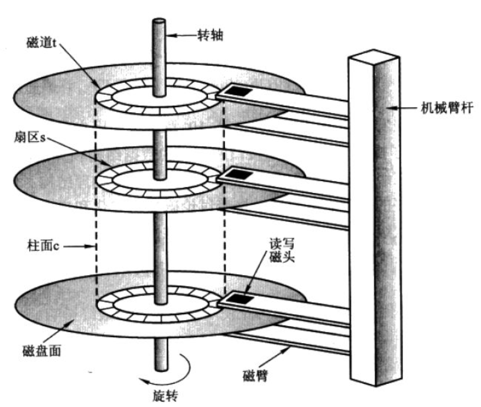
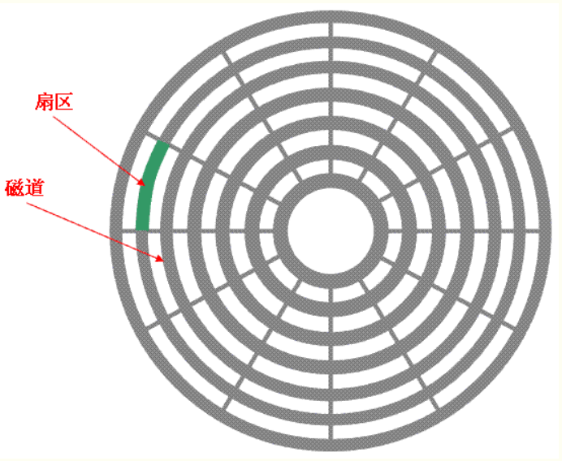
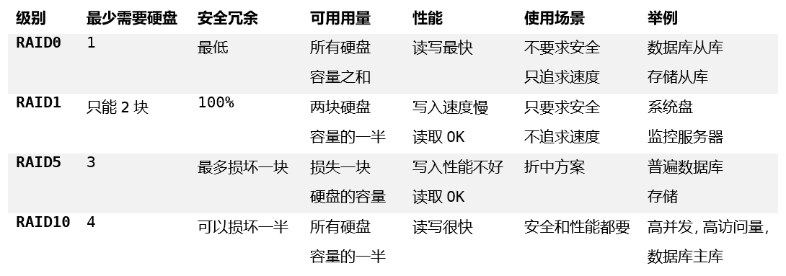
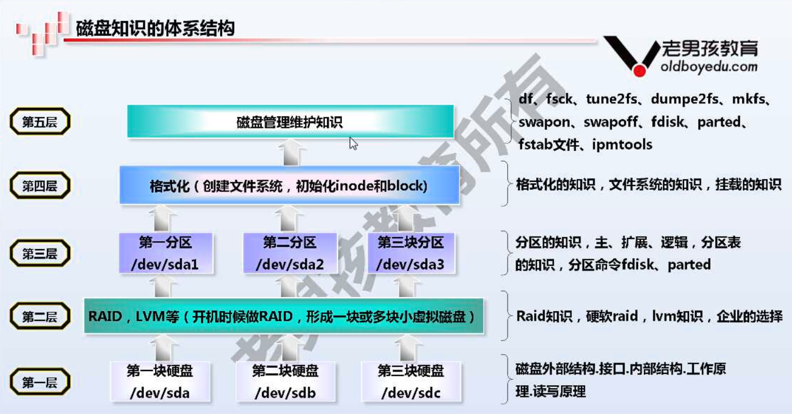

====================================      
  
第25天 周2 20180814 授课老师-李泳谊      
作者: 邢永胜      
  
====================================  
  
# 定时任务作业-昨天

每天晚上12点打包备份/etc/目录  
1.打包备份到/backup目录   
2.删除7天之前的备份 find  
3.保留每周1的备份   find  

李导解答:
    etc-2018-05-20
find /backup -mtime +7 -type f ! -name "etc*_1.tar.gz" | xargs rm

# 批量添加用户 ★★★

批量添加3个用户stu01,stu02....stu10,并设置123456(禁止使用for,while等循环)   
批量添加10个用户stu01,stu02....stu10,并设置8位随机密码(禁止使用for,while等循环)   

深入理解替换，&，命令拼接。此题思路，完全由李导，一步步给出。

## 总体目标

想办法在命令行中，拼接出如下的形式。

useradd stu01; echo 123456|passwd --stdin stu01
useradd stu02; echo 123456|passwd --stdin stu01
useradd stu03; echo 123456|passwd --stdin stu01

## sed替换深入理解

sed替换深入理解，&符号表示对前面匹配内容的引用，sed专有。

    [root@as4k as4k]# echo '123456' | sed -r 's#([0-9])#<\1>#g'
    <1><2><3><4><5><6>
    [root@as4k as4k]# echo '123456' | sed -r 's#([0-9])#<\1>#'
    <1>23456
    [root@as4k as4k]# echo '123456' | sed -r 's#([0-9])#<&>#g'
    <1><2><3><4><5><6>
    [root@as4k as4k]# echo '123456' | sed -r 's#(.)#<&>#g'
    <1><2><3><4><5><6>

## 拼接命令bash执行

拼接名字

    [root@as4k as4k]# echo stu{01..3} | xargs -n 1
    stu01
    stu02
    stu03

完整拼接

    # echo stu{01..3} | xargs -n 1 | \ 
    sed 's#.*#useradd &;echo 123456|passwd --stdin &#g'
    useradd stu01;echo 123456|passwd --stdin stu01
    useradd stu02;echo 123456|passwd --stdin stu02
    useradd stu03;echo 123456|passwd --stdin stu03
    # 观察拼接目标，前后只有stu01 ... stu01在变化，其余内容均无变化，
    # 在sed中前后两次使用&，正是引用stu01 ...

交由bash执行

    # echo stu{01..3} | xargs -n 1 | \ 
    sed 's#.*#useradd &;echo 123456|passwd --stdin &#g' | bash

## 生成随机数

生成8位随机数

    echo $RANDOM | md5sum | cut -c -8

echo stu{01..3} | xargs -n 1 | \ 
sed 's#.*#useradd &; \
echo $RANDOM | md5sum | cut -c -8 | passwd --stdin &#g' | bash

echo $RANDOM | md5sum | cut -c -8 | cat | passwd --stdin steam2

echo $(echo $RANDOM | md5sum | cut -c -8) >> pwd.txt

$RANDOM是内置随机数变量
md5sum可以通过管道传递字符串

## 命令拼接小结

先弄出命令的样子，最后交给bash执行。

1 不用循环，完成循环做出的事情。
2 弄出命令样子。sed awk
3 最后交给bash执行

# 如何让Linux系统安全

最小化
    安装软件    
    安装系统

保护好root
    禁止root用户远程登录，但是可以切换到root用户
    修改远程连接端口号22

文件系统权限
    给系统常用命令 +i
    给系统配置文件 +a

连接到服务器条件
    1 ip地址     用nmap扫描
    2 用户名密码  root
    3 端口号      22

nmap -p22 10.0.0.1-254 # 找这些机器中谁开了22端口
ll  /var/log/secure    # 可以看到，别人是否在破解密码

## md5sum 验证文件内容是否变化

md5sum filename

    只要文件内容一样，指纹信息，就是一样的。

警察局

    指纹信息可以导入到文件中，存放起来()，使用md5sum -c pol.md5，
    即可计算文件内容是否变化，可以放到定时任务中自动运行。
    -c, --check
    md5sum -c pol.md5

    [root@as4k ~]# echo oldboy > oldboy.txt
    [root@as4k ~]# md5sum oldboy.txt 
    3fe396c01f03425cb5e2da8186eb090d  oldboy.txt

    [root@as4k ~]# md5sum oldboy.txt > pol.md5
    [root@as4k ~]# cat pol.md5 
    3fe396c01f03425cb5e2da8186eb090d  oldboy.txt
    [root@as4k ~]# md5sum -c pol.md5
    oldboy.txt: OK
    [root@as4k ~]# > oldboy.txt 
    [root@as4k ~]# md5sum -c pol.md5 
    oldboy.txt: FAILED
    md5sum: WARNING: 1 of 1 computed checksum did NOT match

## rpm -aV 检查系统中那些系统文件变化了

数字5，表示文件内容变了。

    [root@as4k ~]# rpm -aV
    S.5....T.  c /etc/issue
    S.5....T.  c /etc/issue.net
    .......T.  c /etc/inittab
    ....L....  c /etc/pam.d/fingerprint-auth
    ....L....  c /etc/pam.d/password-auth
    ....L....  c /etc/pam.d/smartcard-auth
    ....L....  c /etc/pam.d/system-auth
    S.5....T.  c /etc/bashrc
    S.5....T.  c /etc/profile
    S.5....T.  c /etc/sudoers
    S.5....T.  c /root/.bashrc

## Linux常见查出病毒方法

    1 事先做好指纹，用的时候进行检查
    2 rpm -aV 比较yum安装或rpm安装的软件是否变化
    3 查病毒软件: clamav

## 小作业 待完成

   安装clamav (增加epel源)

# 机械硬盘和固态硬盘

## 接口

机械硬盘，里面有电动机，里面有个光盘可以转。
磁盘也称为硬盘，disk，disk hard.
固态硬盘SSD solid state disk

SATA   串口，家用。
SAS    企业，服务器用。是SATA和SCSI的结合体。
固态硬盘接口 PCI-E
笔记本固态: NVMe  m.2
SAS接口向下兼容SATA
SAS 15k 300G

类似与U盘，里面有闪存芯片。
质保期为: 五年/300 TBW ，五年写入300TB。

机械硬盘主要指标
1 容量
2 转速rpm  round per minute 每分钟多少转
家用 5400  7200
企业 10k   15k

## 机械和固态选择

SATA机械硬盘
    给自己人，线下使用，性能要求不高，存放备份数据。
    10k rpm 2T 3T 4T

SAS机械硬盘
    服务器标配，线上，生产环境中使用
    15K 300G 600G

固态硬盘(PCI-E SAS SATA)
    数据量小，大量的读写，要求很高的性能

## 机械和固态对比

机械硬盘
    容量大价格低
    抗击打能力弱
    读写速度稍慢(IO)
    数据恢复容易
    写入次数不限

固态硬盘
    容量小价格高
    抗击打能力强
    读写速度很快
    数据回复难
    1-2W次写入

# 磁盘的结构及其基本组成

磁头和磁盘之间是有距离的。不是贴着的。

## 磁盘组成部分

盘片（platter）
磁头（head）
磁道（track）
扇区（sector）
柱面（cylinder）

## 盘片,片面和磁头

## 扇区和磁道

扇区是磁盘的最小组成单元，通常是512字节。

## 计算磁盘大小

磁盘大小 = 柱面的大小 * 柱面的数量
柱面的大小 = 磁道的大小 * 磁头的数量
磁道的大小 = 每个磁道扇区数量 * 每个扇区

磁盘大小 = 每个磁道扇区数量 * 每个扇区 * 磁头的数量 * 柱面的数量

查看磁盘信息

    [root@as4k ~]# fdisk -l

    Disk /dev/sda: 21.5 GB, 21474836480 bytes
    255 heads, 63 sectors/track, 2610 cylinders
    Units = cylinders of 16065 * 512 = 8225280 bytes
    Sector size (logical/physical): 512 bytes / 512 bytes
    I/O size (minimum/optimal): 512 bytes / 512 bytes
    Disk identifier: 0x00066f1c

       Device Boot      Start         End      Blocks   Id  System
    /dev/sda1   *           1          26      204800   83  Linux
    Partition 1 does not end on cylinder boundary.
    /dev/sda2              26         124      786432   82  Linux swap / Solaris
    Partition 2 does not end on cylinder boundary.
    /dev/sda3             124        2611    19979264   83  Linux

磁盘大小 = 63 * 512 * 255 * 2610

255 header，不表示实际就是255个磁头。

## 字节大小的计算

字节 bytes，1个1英文字母，是1个字节
回车也是1个符号，占一个字节。

1KB=1024bytes
1MB=1024KB
1GB=1024MB
1TB=1024GB

500G硬盘，实际到手容量不足500G ？
厂家:    1000为单位
计算机中: 1024为单位

# bc和awk的计算功能

    [root@as4k ~]# echo 63*512*255*2610 | bc
    21467980800
    [root@as4k ~]# echo 63*512 | bc
    32256

bc默认不支持小数

    [root@as4k ~]# echo 'scale=5;3/4' | bc
    .75000
    [root@as4k ~]# echo 1/3|bc -l
    .33333333333333333333
    [root@as4k ~]# awk 'BEGIN {print 3/4, 1/2, 1/3}'
    0.75 0.5 0.333333

    [root@as4k ~]# echo 63*512*255*2610 | bc
    21467980800

    [root@as4k ~]# awk 'BEGIN {print 63*512*255*2610 / 1024^3 " GB"}'
    19.9936 GB

bc和python可直接在命令行中交互使用，CTRL + D 退出

# RAID

RAID5 具有奇偶校验功能。
RAID5+Spare(热备盘)，可动态实时替换损坏盘。

## 组成RAID目的

1 获得更大的容量
2 获得更高的性能
3 获得更好的安全性

# 参考资料

磁盘知识体系结构

老男孩教育出品-磁盘结构及接口
https://www.processon.com/view/link/5a0a5c84e4b0d53d9798531d

磁盘磁道
https://www.cnblogs.com/jswang/p/9071847.html

老男孩教育出品-raid级别及应用场景
https://www.processon.com/view/link/5a0ba742e4b049e7f4fd8e2b

查询系统统性能命令
https://www.processon.com/view/link/5b4d5eb5e4b0ade3e27f719a

# 总结-25天

1 定时任务作业
2 批量添加用户
3 磁盘接口即应用的场景
4 磁头，柱面，扇区，磁道
5 Linux如何计算，磁盘大小
6 RAID级别，0 1 5 10 特点和应用(常见面试题)

# 预习

1 磁盘分区，格式化，挂载
2 磁盘相关命令

