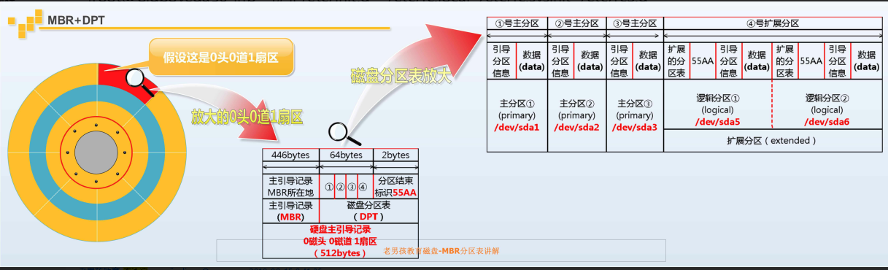

====================================        
    
第26天 周3 20180815 授课老师-李泳谊        
作者: 邢永胜        
    
====================================    
    
# 昨天知识回顾和补充  
  
[root@as4k ~]# echo 123 | sha512sum   
ea2fe56bb8c1fb5ada84963b42ed71b764a74b092d75755173ade06f2f4aada9c00d6c302e185035cbe85fdff31698bca93e8661f0cbcef52cf2ff65864fd742  -  
  
1 磁盘组成  
2 RAID级别  
3 如何让系统更安全  
4 磁盘接口  
5 如何进行计算  
  
如何防止系统中木马  
http://lidao.blog.51cto.com/3388056/1910889  
  
# 今日知识点概览  
  
1 如何查看内存使用情况  
2 磁盘分区  
3 进行分区，格式化，挂载  
4 一大波磁盘相关命令  
  
# 内存查看  
  
## 为什么我的内存没啦 ？  
  
[root@as4k ~]# free -h  
             total       used       free     shared    buffers     cached  
Mem:          980M       911M        69M       188K        77M       695M  
-/+ buffers/cache:       138M       841M  
Swap:         767M       388K       767M  
  
Linux系统会把，以前的操作缓存起来，以备下次使用，因此会占用一定内存。  
  
真正剩余的内存是，free + buffer + cache  
  
读 cache  
写 buffer  
  
# 磁盘分区  
  
  
  
## Linux启动流程  
  
1) 开机自检(BIOS)  
     硬件检查，内存，CPU，硬盘是否有问题  
2) MBR引导  
3) GRUB引导菜单  
     在这里可以选择不同的内核 2.6.30.xxx  
4) 加载内核(kernel)  
     把/boot中的内核程序放到内存中  
5) 运行INIT进程  
     linux系统的第一个进程  
6) 读取/etc/inittab配置文件  
     确定系统的运行级别  
7) 执行系统的初始化脚本，设置主机名，设置IP地址  
     执行/etc/rc.d/rc.sysinit 脚本  
8) 根据系统运行级别，在开机的时候启动不同的软件  
     执行/etc/rc.d/rc3.d/ 脚本 文本模式  
9) 启动mingetty，进入系统登录界面  
  
## MBR   
  
磁盘的引导扇区，0磁道，0磁道，1扇区  
MBR的位置     0头0道1扇区，前446字节  
MBR (Master Boot Record) 主引导记录 引导系统启动  
  
DPT (Disk Partition Table) 磁盘分区表  
  
主分区(primary)，每个分区占用16个字节的分区表，最多可有4个主分区  
扩展分区(extended)  
逻辑分区(logical)  
  
主分区加上扩展分区，最多只能有4个  
  
## 磁盘分区的命名规则  
  
[root@as4k ~]# ll /dev/sda*  
brw-rw---- 1 root disk 8, 0 Aug 12  2018 /dev/sda  
brw-rw---- 1 root disk 8, 1 Aug 12  2018 /dev/sda1  
brw-rw---- 1 root disk 8, 2 Aug 12  2018 /dev/sda2  
brw-rw---- 1 root disk 8, 3 Aug 12  2018 /dev/sda3  
  
磁盘  
    SAS/SATA/SCSI  /dev/sd?  
    第一块硬盘SAS  /dev/sda  
    第三块SATA硬盘 /dev/sdc   
      
磁盘分区   
    主分区和扩展分区 1-4   
    逻辑分区，从5开始  
      
磁盘命令举例  
  
第1块sas硬盘的第一个主分区   
第2块sata硬盘的第2个主分区  
第3块sata硬盘的第1个逻辑分区  
/dev/sda1   
/dev/sdb2  
/dev/sdc5  
  
往虚拟机中添加2块，200M的硬盘，重启  
[root@as4k ~]# fdisk -l | grep sd[a-c]:  
Disk /dev/sda: 21.5 GB, 21474836480 bytes  
Disk /dev/sdb: 213 MB, 213909504 bytes  
Disk /dev/sdc: 213 MB, 213909504 bytes  
  
# 空磁盘使用步骤  
  
  
## fdisk 创建分区  
  
fdisk -l  
-u 以柱面为单位  
-c 关闭DOS兼容模式  
  
fdisk -cu /dev/sdb  
      
第一次使用fdisk  
[root@as4k ~]# fdisk -cu /dev/sdb  
Device contains neither a valid DOS partition table, nor Sun, SGI or OSF disklabel  
Building a new DOS disklabel with disk identifier 0xa752489c.  
Changes will remain in memory only, until you decide to write them.  
After that, of course, the previous content won't be recoverable.  
  
Warning: invalid flag 0x0000 of partition table 4 will be corrected by w(rite)  
  
fdisk内部命令  
    m 显示帮助  
    n new创建分区  
    p 显示所有分区信息  
    d 删除分区  
    w 保存并退出  
    q 退出不保存  
      
CTRL+U 删除一行内容  
  
Command (m for help): n  
Command action  
   e   extended  
   p   primary partition (1-4)  
p  
Partition number (1-4): 1     
First sector (2048-417791, default 2048):  #回车选择默认  
Using default value 2048  
Last sector, +sectors or +size{K,M,G} (2048-417791, default 417791): +10M #选择10M的分区大小  
  
Command (m for help): p  
  
Disk /dev/sdb: 213 MB, 213909504 bytes  
64 heads, 32 sectors/track, 204 cylinders, total 417792 sectors  
Units = sectors of 1 * 512 = 512 bytes  
Sector size (logical/physical): 512 bytes / 512 bytes  
I/O size (minimum/optimal): 512 bytes / 512 bytes  
Disk identifier: 0xa752489c  
  
   Device Boot      Start         End      Blocks   Id  System  
/dev/sdb1            2048       22527       10240   83  Linux  
  
  
fdisk 练习题  
创建10MB的主分区，创建一个使用所有容量的扩展分区，创建两个50MB逻辑分区  
发出p的结果  
   Device Boot      Start         End      Blocks   Id  System  
/dev/sdb1            2048       22527       10240   83  Linux  
/dev/sdb2           22528      417791      197632    5  Extended  
/dev/sdb5           24576      126975       51200   83  Linux  
/dev/sdb6          129024      231423       51200   83  Linux  
  
删除分区，输入d，然后提示输入删除分区的编号  
  
实际工作，增加硬盘200M，硬盘创建一个分区挂载到/data目录  
  
## 第1个里程碑-创建分区   
  
Device Boot      Start         End      Blocks   Id  System  
/dev/sdb1        1             204      208880   83  Linux  
  
Command action  
   e   extended  
   p   primary partition (1-4)  
p    
Partition number (1-4): 1  
First cylinder (1-204, default 1):   
Using default value 1  
Last cylinder, +cylinders or +size{K,M,G} (1-204, default 204):   
Using default value 204  
  
Command (m for help): p  
  
Disk /dev/sdb: 213 MB, 213909504 bytes  
64 heads, 32 sectors/track, 204 cylinders  
Units = cylinders of 2048 * 512 = 1048576 bytes  
Sector size (logical/physical): 512 bytes / 512 bytes  
I/O size (minimum/optimal): 512 bytes / 512 bytes  
Disk identifier: 0xa752489c  
  
   Device Boot      Start         End      Blocks   Id  System  
/dev/sdb1               1         204      208880   83  Linux  
  
Command (m for help): w  
The partition table has been altered!  
  
Calling ioctl() to re-read partition table.  
Syncing disks.  
  
[root@as4k ~]# fdisk /dev/sdb  
  
WARNING: DOS-compatible mode is deprecated. It's strongly recommended to  
         switch off the mode (command 'c') and change display units to  
         sectors (command 'u').  
           
## 第2个里程碑-通知系统sdb磁盘分区表变化  
  
partprobe /dev/sdb   
  
## 第3个里程碑-创建文件系统(格式化)  
  
mkfs.ext4 /dev/sdb1  
  
[root@as4k ~]# mkfs.ext4 /dev/sdb1  
mke2fs 1.41.12 (17-May-2010)  
Filesystem label=  
OS type: Linux  
Block size=1024 (log=0)  
Fragment size=1024 (log=0)  
Stride=0 blocks, Stripe width=0 blocks  
52416 inodes, 208880 blocks  
10444 blocks (5.00%) reserved for the super user  
First data block=1  
Maximum filesystem blocks=67371008  
26 block groups  
8192 blocks per group, 8192 fragments per group  
2016 inodes per group  
Superblock backups stored on blocks:   
	8193, 24577, 40961, 57345, 73729, 204801  
  
Writing inode tables: done                              
Creating journal (4096 blocks): done  
Writing superblocks and filesystem accounting information: done  
  
This filesystem will be automatically checked every 39 mounts or  
180 days, whichever comes first.  Use tune2fs -c or -i to override.  
每39次或180天后，会自动检查。  
  
## 第5个里程碑-关闭自动检查  
  
tune2fs -c 0 -i 0 /dev/sdb1  
  
[root@as4k ~]# tune2fs -c 0 -i 0 /dev/sdb1  
tune2fs 1.41.12 (17-May-2010)  
Setting maximal mount count to -1  
Setting interval between checks to 0 seconds  
-c 每挂载多少次进行1次磁盘加载，0就是关闭  
-i，每隔180天进行一次磁盘检查，0就是关闭  
  
## 第5个里程碑-挂载  
  
mount /dev/sdb1 /data/  
  
[root@as4k ~]# df -h  
Filesystem      Size  Used Avail Use% Mounted on  
/dev/sda3        19G   13G  5.7G  69% /  
tmpfs           491M     0  491M   0% /dev/shm  
/dev/sda1       190M   35M  146M  19% /boot  
/dev/sdb1       194M  1.8M  182M   1% /data  
  
## 第6个里程碑-永久挂载  
  
方法1  
/etc/fstab    开机自动挂载  
  
UUID=7deaff56-34a4-427e-9bbb-9e15e4d7c490 /       ext4    defaults,acl        1 1  
UUID=d2ca6e87-2287-4323-8d8b-0502867f852a /boot   ext4    defaults            1 2  
UUID=ba32a9b3-a0bb-4e3c-8b3e-3d78e3498c6d swap    swap    defaults            0 0  
tmpfs                   /dev/shm                tmpfs   defaults        0 0  
devpts                  /dev/pts                devpts  gid=5,mode=620  0 0  
sysfs                   /sys                    sysfs   defaults        0 0  
proc                    /proc                   proc    defaults        0 0  
以上6个字段的含义如下:  
设备名称(分区)   
挂载点（目录）      
文件系统类型    
挂载参数         
是否进行备份      
是否开机磁盘检查  
  
手动添加挂载目录，格式如下:  
/dev/sdb1  /data    ext4 defaults  0  0  
  
光盘的文件系统:  
/dev/cdrom  /mnt    iso9660 defaults  0  0  
  
方法2  
/etc/rc.local 开机自动执行  
写入 mount /dev/sdb1 /data/  
  
## 磁盘使用小结  
  
fdisk -cu /dev/sdb  
partprobe /dev/sdb  
mkfs.ext4 /dev/sdb1   
tune2fs -c 0 -i 0 /dev/sdb1  
mount /dev/sdb1 /data/  
  
   
  
# 故障案例: 内存不足，swap顶上  
  
java程序占用大量内存，开始使用swap，swap不足。  
需要增加swap  
  
创建一个文件，成为swap  
[root@as4k ~]# free -h  
             total       used       free     shared    buffers     cached  
Mem:          980M       151M       829M       200K        12M        46M  
-/+ buffers/cache:        91M       888M  
Swap:         767M         0B       767M  
  
## 1 创建1个100M的文件 dd  
  
dd if=/dev/zero of=/tmp/100m bs=1M count=100  
if input file 从哪里获取数据  
/dev/zero 特殊设备 不断输出 零  
of output file 输出文件，表示把数据输出到哪里  
block size 每次复制多少文件  
count 复制的次数  
  
[root@as4k ~]# dd if=/dev/zero of=/tmp/100m bs=1M count=100  
100+0 records in  
100+0 records out  
104857600 bytes (105 MB) copied, 0.425648 s, 246 MB/s  
[root@as4k ~]# ls -lh /tmp/100m  
-rw-r--r-- 1 root root 100M Jul 26 20:18 /tmp/100m  
[root@as4k ~]# dd if=/dev/zero of=/tmp/1G bs=1M count=1000  
1000+0 records in  
1000+0 records out  
1048576000 bytes (1.0 GB) copied, 3.83504 s, 273 MB/s  
  
[root@as4k ~]# file /tmp/100m  
/tmp/100m: data  
  
## 2 创建swap，让/tmp/100m成为swap(类似格式化) mkswap  
mkswap  
[root@as4k ~]# mkswap /tmp/100m  
[root@as4k ~]# file /tmp/100m  
/tmp/100m: Linux/i386 swap file (new style) 1 (4K pages) size 25599 pages  
  
## 3 激活swap分区 swapon  
free -h  
swapon /tmp/100m   
free -h  
swapon -s  
  
[root@as4k ~]# swapon -s  
Filename				Type		Size	Used	Priority  
/dev/sda2                               partition	786428	0	-1  
/tmp/100m                               file		102396	0	-2  
  
## 4 永久增加swap  
方法1 /etc/rc.local  
swapon /tmp/100m  
  
方法2 /etc/fstab  
/tmp/100m swap swap defaults 0 0  
  
## 增加swap小结  
  
1 创建1个文件   
    dd if=/dev/zero of=/tmp/100m bs=1M count=100  
2 让这个文件变成swap类型   
    mkswap /tmp/100m  
3 激活此文件  
    swapon /tmp/100m   
  
更改配置文件可使其永久生效。  
  
# parted 2T+用我  
  
fdisk  只支持2TB以内的磁盘  只支持MBR磁盘分区表  
parted 支持2TB以上的磁盘    MBR(主分区最多4个)  GPT(没有太大限制，接近无限)  
  
[root@as4k ~]# parted /dev/sdc  
GNU Parted 2.1  
Using /dev/sdc  
Welcome to GNU Parted! Type 'help' to view a list of commands.  
(parted)     
  
## 内置命令  
  
显示分区信息  
    print, p   
创建磁盘分区表  
    mktable, mklabel   mktable  gpt msdos(mbr)  
删除分区  
    rm      
退出不保存  
    q         
创建分区  
    mkpart primary 0 10    
  
> parted执行的分区，实时生效，谨慎操作  
  
## 创建分区表  
  
(parted) mktable gpt  
(parted) p                                                                  
Model: VMware, VMware Virtual S (scsi)  
Disk /dev/sdc: 214MB  
Sector size (logical/physical): 512B/512B  
Partition Table: gpt  
  
Number  Start  End  Size  File system  Name  Flags  
  
(parted)                                                                    
  
## 创建分区   
  
(parted) mkpart primary 0 10  
Warning: The resulting partition is not properly aligned for best performance.  
Ignore/Cancel? i                                                            
(parted) p                                                                  
Model: VMware, VMware Virtual S (scsi)  
Disk /dev/sdc: 214MB  
Sector size (logical/physical): 512B/512B  
Partition Table: gpt  
  
(parted) p                                                                  
Model: VMware, VMware Virtual S (scsi)  
Disk /dev/sdc: 214MB  
Sector size (logical/physical): 512B/512B  
Partition Table: gpt  
  
Number  Start   End     Size    File system  Name     Flags  
 1      17.4kB  10.0MB  9983kB               primary  
 2      10.5MB  19.9MB  9437kB               primary  
  
## 删除分区表  
  
(parted) rm 2                                                               
(parted) p                                                                  
Model: VMware, VMware Virtual S (scsi)  
Disk /dev/sdc: 214MB  
Sector size (logical/physical): 512B/512B  
Partition Table: gpt  
  
Number  Start   End     Size    File system  Name     Flags  
 1      17.4kB  10.0MB  9983kB               primary  
  
## 非交互式使用parted  
  
parted /dev/sdc p   
parted /dev/sdc mktable gpt  
parted /dev/sdc mkpart primary 0 10 ignore  
parted /dev/sdc p   
  
## parted使用总结  
  
进入       parted /dev/sdc  
创建分区表  mktable gpt  
创建分区    mkpart primary 0 10  
  
# 总结-26天  
  
1 磁盘分区命名规则  
2 磁盘分区表 主分区 扩展分区 逻辑分区   
3 磁盘分区过程   
4 增加swap  
5 如何查看内存使用情况  
  
# 预告-接下里的学习计划  
  
常见文件系统  
一对磁盘相关的命令  
shell编程-判断-循环  
  
sed  
awk  awk数组  
网络  
