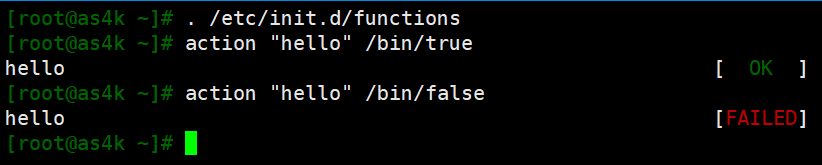

====================================              
    
第29天  第7周  20180820  周1  
授课老师-李泳谊  学生-邢永胜              
    
====================================          
          
# 上周五回顾  
  
我们现在学习的shell编程就是bash编程。  
1. 普通变量与环境变量区别  
2. 变量命名规则  
3. 特殊变量 $1 $2 $# $?  
4. 判断  
    条件表达式(测试表达式) [ -d ] [ -f ]  
    if判断 单分支 双分支 多分支  
      
# 小题1-检查定时任务是否在运行  
  
企业案例题:书写脚本检查crond是否在运行  
1.如果运行显示crond is running   
2.如果没有运行crond is not running   
  
## 分析  
  
1) 需求分析  
ps -ef | grep crond  
  
2) 条件是什么  
ps -ef | grep crond | wc -l  
  
## 解答  
  
```  
  
[root@as4k scripts]# sh if-crond.sh   
crnod is not running  
[root@as4k scripts]# /etc/init.d/crond start  
Starting crond:                             [  OK  ]  
[root@as4k scripts]# sh if-crond.sh   
crond is running  
[root@as4k scripts]# cat if-crond.sh   
#!/bin/bash  
count=`ps aux | grep crond | wc -l`  
if [ $count -gt 3 ]; then  
    echo "crond is running"  
else  
    echo "crnod is not running"  
fi  
[root@as4k scripts]#   
  
[root@as4k scripts]# /etc/init.d/crond status | grep running  
crond (pid  13996) is running...  
[root@as4k scripts]# /etc/init.d/crond status | grep running | wc -l  
1  
[root@as4k scripts]# /etc/init.d/crond stop  
Stopping crond:                                            [  OK  ]  
[root@as4k scripts]# /etc/init.d/crond status  
crond is stopped  
[root@as4k scripts]# /etc/init.d/crond status | grep stopped | wc -l  
1  
  
```  
  
检查谁，文件不要和这个服务冲突  
  
## 让脚本显示颜色  
  
. /etc/init.d/functions 激活action功能  
action "hello" /bin/true  显示绿色OK  
action "hello" /bin/false 显示红色FAILED  
  
  
  
    [root@as4k scripts]# . /etc/init.d/functions   
    [root@as4k scripts]# action "sdfsd"   
    sdfsd                                                      [  OK  ]  
    [root@as4k scripts]# action "sdfsd" /bin/false  
    sdfsd       
  
    [root@as4k scripts]# /etc/init.d/crond stop  
    [root@as4k scripts]# sh crr.sh   
    crnod is not running                                       [FAILED]  
    [root@as4k scripts]# /etc/init.d/crond start  
    Starting crond:                                            [  OK  ]  
    [root@as4k scripts]# sh crr.sh   
    crond is running                                           [  OK  ]  
  
检查定时任务输出颜色优化  
  
```sh  
#!/bin/bash  
# cat crr.sh   
. /etc/init.d/functions  
count=`/etc/init.d/crond status | grep running | wc -l`  
  
if [ $count -eq 1 ]; then  
    action "crond is running"  
else  
    action "crnod is not running" /bin/false  
fi  
```  
  
## 小结  
  
1 检查服务状态  
2 注意事项: 脚本名称不要包含服务/进程的名字  
3 注意事项: 过滤本身  
  
ps aux | grep -v grep | grep crond  
ps aux | grep [c]rond  
  
[root@as4k scripts]# ps aux | grep -v grep | grep crond  
root      14342  0.0  0.1 116892  1280 ?        Ss   10:29   0:00 crond  
[root@as4k scripts]# ps aux | grep [c]rond  
root      14342  0.0  0.1 116892  1280 ?        Ss   10:29   0:00 crond  
[root@as4k scripts]# ps aux | grep crond  
root      14342  0.0  0.1 116892  1280 ?        Ss   10:29   0:00 crond  
root      14388  0.0  0.0 103332   844 pts/3    S+   10:55   0:00 grep --color=auto crond  
  
解释: ps -ef | grep '[c]rond'  
进程名字: grep [c]rond  
执行名字: grep crond  
  
# 循环 for  
  
for variable [in words ]; do  
    commands  
done  
  
# 小题2-循环输出如下内容  
  
    [root@as4k scripts]# sh tao.sh   
    tao,01week 01group take you to DBJ, find 01woman.  
    tao,02week 02group take you to DBJ, find 02woman.  
    tao,03week 03group take you to DBJ, find 03woman.  
    tao,04week 04group take you to DBJ, find 04woman.  
    tao,05week 05group take you to DBJ, find 05woman.  
    tao,06week 06group take you to DBJ, find 06woman.  
    [root@as4k scripts]# cat tao.sh   
    #!/bin/bash  
    for i in {01..6}; do  
        echo "tao,${i}week ${i}group take you to DBJ, find ${i}woman."  
    done  
  
for写在命令行中成为一行，使用分号分割  
    for i in {01..6}; do echo "tao,${i}week ${i}group take you to DBJ, find ${i}woman."; done  
  
# 小题3-优化系统开机启动项  
  
只保留crond,sshd,network,rsyslog,sysstat其余服务都关闭  
  
磨刀:  
    crond|sshd|network|rsyslog|sysstat  
    chkconfig | awk '{print $1}'  
    chkconfig | awk '{print $1}' | egrep -v 'crond|sshd|network|rsyslog|sysstat'  
    chkconfig | awk '! /crond|sshd|network|rsyslog|sysstat/ {print $1}'  
  
实现:  
    [root@as4k scripts]# cat adc.sh   
    #!/bin/bash  
    for name in `chkconfig | awk '{print $1}' | egrep -v 'crond|sshd|network|rsyslog|sysstat'`; do  
        chkconfig $name off  
    done  
  
检查:  
    [root@as4k scripts]# chkconfig | grep 3:on  
    crond          	0:off	1:off	2:on	3:on	4:on	5:on	6:off  
    network        	0:off	1:off	2:on	3:on	4:on	5:on	6:off  
    rsyslog        	0:off	1:off	2:on	3:on	4:on	5:on	6:off  
    sshd           	0:off	1:off	2:on	3:on	4:on	5:on	6:off  
    sysstat        	0:off	1:on	2:on	3:on	4:on	5:on	6:off  
  
提示: chkconfig 默认处理的是2345 相当于 chkconfig --level 2345 xxx off  
  
# 小题4-批量添加用户，并设置8位随机密码  
  
    [root@as4k scripts]# cat ran_user.sh   
    #!/bin/bash  
    for i in stu{01..5}; do  
        ran_passwd=`date +%N | md5sum | cut -c -8`  
        useradd $i  
        echo "$i $ran_passwd" >> /tmp/passwd.txt  
        echo $ran_passwd | passwd --stdin $i  
    done  
    [root@as4k scripts]# sh ran_user.sh   
    Changing password for user stu01.  
    passwd: all authentication tokens updated successfully.  
    Changing password for user stu02.  
    passwd: all authentication tokens updated successfully.  
    Changing password for user stu03.  
    passwd: all authentication tokens updated successfully.  
    Changing password for user stu04.  
    passwd: all authentication tokens updated successfully.  
    Changing password for user stu05.  
    passwd: all authentication tokens updated successfully.  
    [root@as4k scripts]# echo stu{01..5} | xargs -n 1 id  
    uid=1001(stu01) gid=1001(stu01) groups=1001(stu01)  
    uid=1002(stu02) gid=1002(stu02) groups=1002(stu02)  
    uid=1003(stu03) gid=1003(stu03) groups=1003(stu03)  
    uid=1004(stu04) gid=1004(stu04) groups=1004(stu04)  
    uid=1005(stu05) gid=1005(stu05) groups=1005(stu05)  
    [root@as4k scripts]# cat /tmp/passwd.txt  
    stu01 3f40cecb  
    stu02 8df4637d  
    stu03 568ed859  
    stu04 d6c85053  
    stu05 957043a8  
  
    echo stu{01..5} | xargs -n 1 userdel -r  
    echo stu{01..5} | xargs -n 1 id  
  
# 在Linux中生成随机数  
  
## 方法1-对每一纳秒做md5sum  
  
    [root@as4k scripts]#   
    [root@as4k scripts]# date +%N  
    354847118  
    [root@as4k scripts]# date +%N  
    684020212  
  
    [root@as4k scripts]# date +%N | md5sum  
    9a443f6e627423e1ed03226c4fe7322d  -  
  
    %N 表示的是纳秒  
    md5sum也可以换成sha系列  
    可以cut -c -8切割  
  
## 方法2-$RANDOM  
  
echo $RANDOM # 生成随机数，0~65535  
  
生成指定位数: 8位数  
    echo $RANDOM+10000000 | bc  
    加上1千万，保底也是9位数，最大还是8位数，但这种已然不怎么"随机"。  
  
echo $(( 2*20 ))  
      
    [root@as4k scripts]# echo $(( $RANDOM + 10000000 ))  
    10002663  
    [root@as4k scripts]# echo $(( $RANDOM + 10000000 ))  
    10003709  
  
# 三剑客总结  
  
sed grep awk   
  
find  
    -maxdepth 深度  
    -type 类型  
    -name 名字  
    -aname 不区分大小写  
    -mtime 修改时间  
    -size 大小  
    !  
    -exec 执行  
    -perm 权限  
  
grep   
    -v 反转查找  
    -n 行号  
    -E egrep  
    -i 不区分大小写   
    -o 只输出文件中匹配的部分  
    -l 过滤时，只显示文件名  
    -A After e.g. -A2  
    -B Before  
    -C Context，上下  
    --color 显示颜色  
      
sed stream editor 流编辑器  
    -r 支持扩展正则  
    -n 屏蔽默认输出  
    -i 修改  
    -i.bak  
  
sed -r     's#[0-9]+##g'     oldboy.txt      
    选项    命令     小尾巴  
sed    '条件 命令'  
sed -n '1 p'  
sed   'pattern 命令'  
  
sed命令执行过程  
1 读取文件内容第1行  
2 是否满足条件  
    2.1 满足条件，执行对应的命令，p s d   
    2.2 不满足条件，继续第1步，再读一行   
3 截至到文件的最后一行  
  
# sed 增删改查  
  
## 查找  
  
创建环境:  
cat>person.txt<<EOF  
101,oldboy,CEO  
102,zhangyao,CTO  
103,Alex,COO  
104,yy,CFO  
105,feixue,CIO  
110,lidao,COCO  
EOF  
  
取行 (首选单引号)  
    sed -n '5 p'   person.txt   
    sed -n '2,5 p' person.txt   
    sed -n '2,$ p' person.txt  
      
    sed -n '1p;4p;5p'      person.txt  
    sed -n '/oldboy/ p'    person.txt  
    sed -n '/101/,/105/ p' person.txt      
  
显示第5行  
    [root@as4k as4k]# sed -n '5 p' person.txt   
    105,feixue,CIO  
  
显示文件第2~5行  
    [root@as4k as4k]# sed -n '2,5 p' person.txt   
    102,zhangyao,CTO  
    103,Alex,COO  
    104,yy,CFO  
    105,feixue,CIO  
  
显示文件第3行~最后一行  
    [root@as4k as4k]# sed -n '2,$ p' person.txt   
    102,zhangyao,CTO  
    103,Alex,COO  
    104,yy,CFO  
    105,feixue,CIO  
    110,lidao,COCO  
      
显示文件的第1，第4，第5行  
    [root@as4k as4k]# sed -n -e '1p' -e '4p' -e '5p' person.txt   
    101,oldboy,CEO  
    104,yy,CFO  
    105,feixue,CIO  
      
    OR sed -n -e '1p;4p;5p' person.txt  
      
过滤oldboy   
    [root@as4k as4k]# sed -n '/oldboy/ p' person.txt  
    101,oldboy,CEO  
  
显示包含101到包含105  
    [root@as4k as4k]# sed -n '/101/,/105/ p' person.txt  
    101,oldboy,CEO  
    102,zhangyao,CTO  
    103,Alex,COO  
    104,yy,CFO  
    105,feixue,CIO  
      
显示奇数行  
  
    [root@as4k as4k]# seq 10 | sed -n '1~2 p'  
    1  
    3  
    5  
    7  
    9  
  
当前行的下面俩行  
      
    [root@as4k as4k]# sed -n '/Alex/, +2 p' person.txt  
    103,Alex,COO  
    104,yy,CFO  
    105,feixue,CIO  
  
# 总结-第29天  
  
1 shell编程  
2 sed 执行过程  
3 sed 增删改查之查找  
    sed -n '5 p'   person.txt   
    sed -n '2,5 p' person.txt   
    sed -n '2,$ p' person.txt  
      
    sed -n '1p;4p;5p'      person.txt  
    sed -n '/oldboy/ p'    person.txt  
    sed -n '/101/,/105/ p' person.txt   
      
# 预习  
  
sed 增加 删除 替换  
  
awk  
